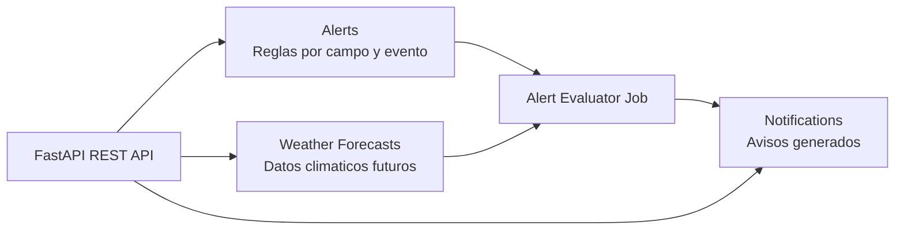
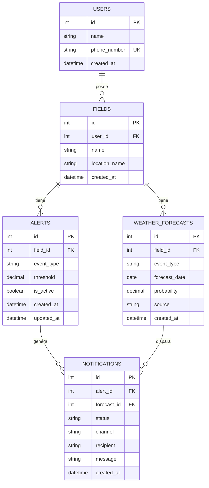

## Diagrama de flujo Mermaid:

[Mermaid link](https://mermaid.live/) para poder pegar el codigo y ver el diagrama.

```mermaid
flowchart LR
    WF[Weather Forecasts\nDatos climaticos futuros]
    A[Alerts\nReglas por campo y evento]
    EJ[Alert Evaluator Job]
    N[Notifications\nAvisos generados]
    API[FastAPI REST API]

    API --> WF
    API --> A
    A --> EJ
    WF --> EJ
    EJ --> N
    API --> N
```

## Diagrama de base de datos

```mermaid
erDiagram
    USERS ||--o{ FIELDS : posee
    FIELDS ||--o{ ALERTS : tiene
    FIELDS ||--o{ WEATHER_FORECASTS : tiene
    ALERTS ||--o{ NOTIFICATIONS : genera
    WEATHER_FORECASTS ||--o{ NOTIFICATIONS : dispara

    USERS {
        int id PK
        string name
        string phone_number UK
        datetime created_at
    }

    FIELDS {
        int id PK
        int user_id FK
        string name
        string location_name
        datetime created_at
    }

    ALERTS {
        int id PK
        int field_id FK
        string event_type
        decimal threshold
        boolean is_active
        datetime created_at
        datetime updated_at
    }

    WEATHER_FORECASTS {
        int id PK
        int field_id FK
        string event_type
        date forecast_date
        decimal probability
        string source
        datetime created_at
    }

    NOTIFICATIONS {
        int id PK
        int alert_id FK
        int forecast_id FK
        string status
        string channel
        string recipient
        string message
        datetime created_at
    }
```
